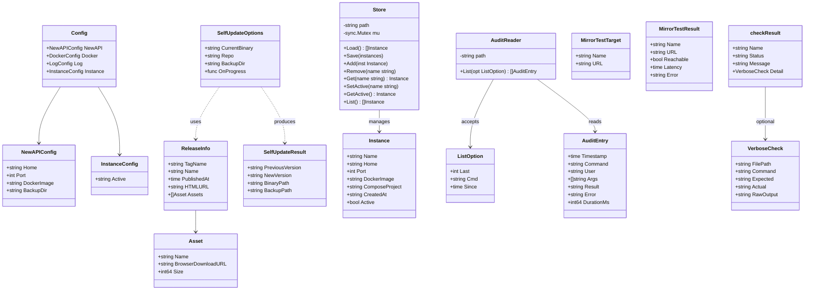
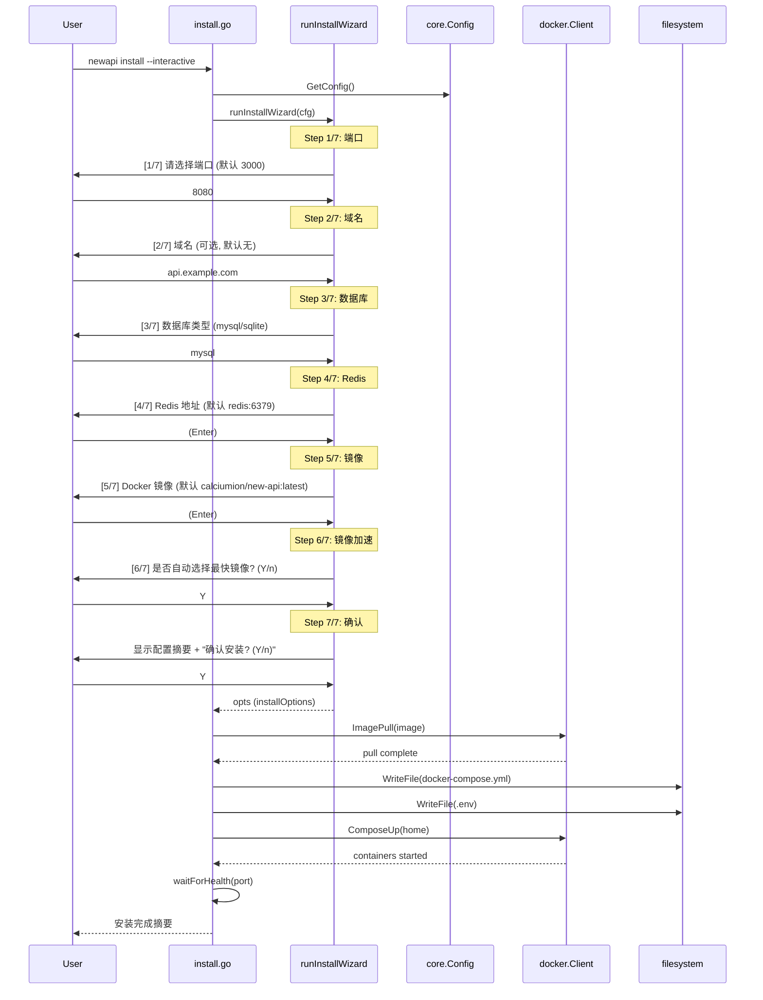
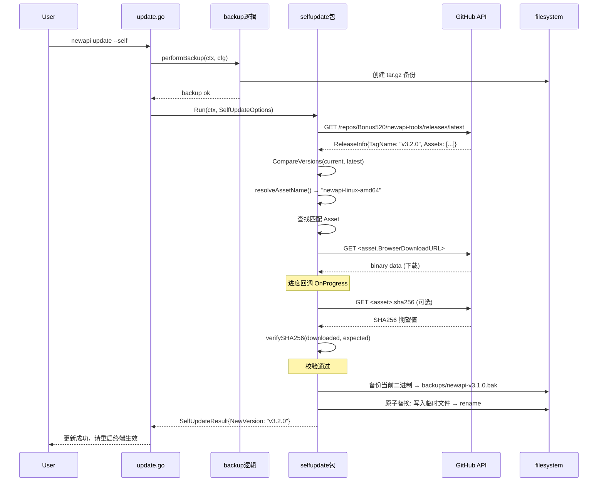
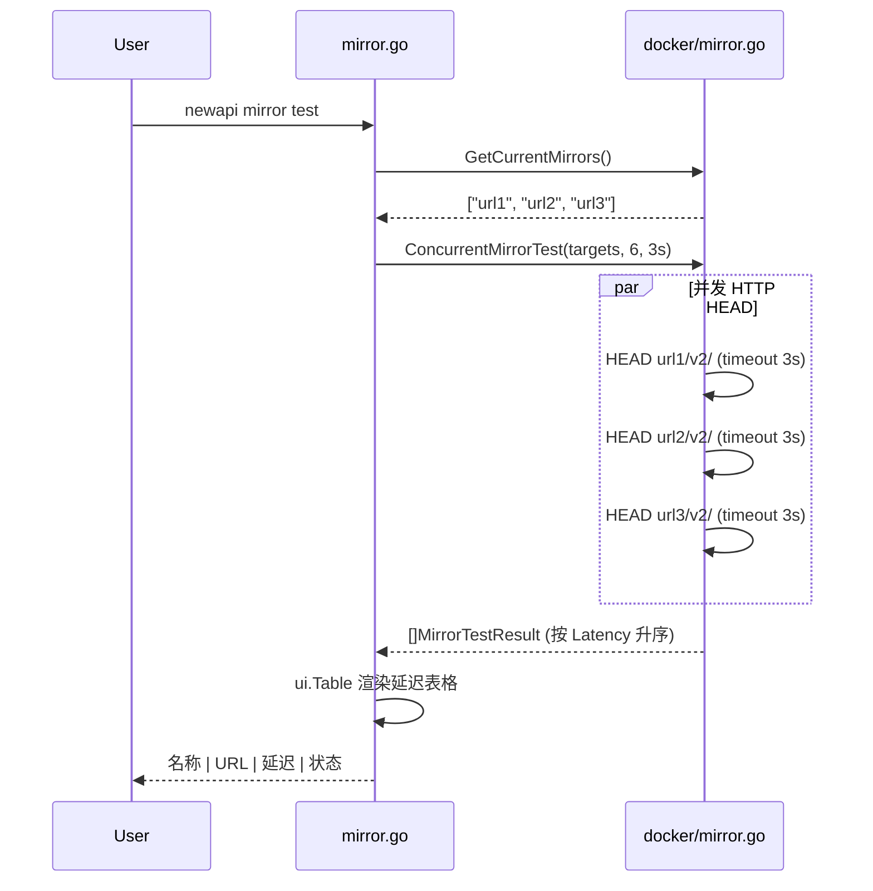
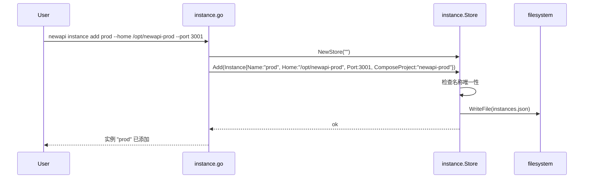
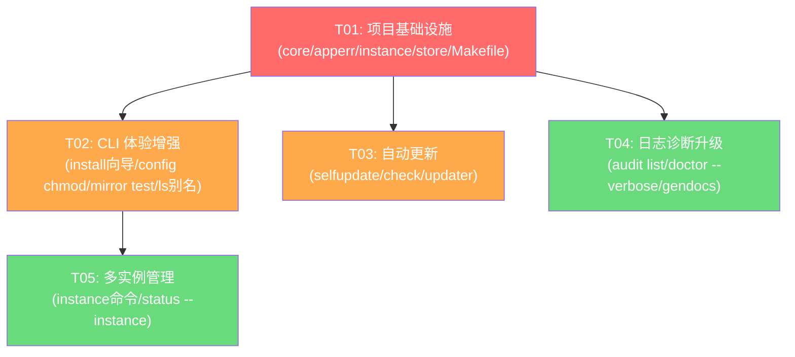

# NewAPI Tools V3.2 系统架构设计

> 架构师：高见远（Gao）  
> 版本：v3.2-draft-1  
> 日期：2025-07-11  
> 基于：V3.2 PRD + V3.1.0 代码分析

---

## 目录

- [Part A：系统设计](#part-a系统设计)
  - [1. 实现方案与框架选型](#1-实现方案与框架选型)
  - [2. 文件列表](#2-文件列表)
  - [3. 数据结构与接口](#3-数据结构与接口)
  - [4. 程序调用流程](#4-程序调用流程)
  - [5. 待明确事项](#5-待明确事项)
- [Part B：任务分解](#part-b任务分解)
  - [6. 依赖包列表](#6-依赖包列表)
  - [7. 任务列表](#7-任务列表)
  - [8. 共享知识](#8-共享知识)
  - [9. 任务依赖图](#9-任务依赖图)

---

# Part A：系统设计

## 1. 实现方案与框架选型

### 1.1 核心技术挑战

| # | 挑战 | 分析 | 方案 |
|---|------|------|------|
| 1 | `install --interactive` 完整向导 | 现有 `runInstallWizard` 仅 3 步（端口/DB/Redis），缺少域名、镜像选择、确认摘要 | 重构向导为 7 步流程，新增 `WizardStep` 接口统一管理，引入「确认摘要」+「回退修改」机制 |
| 2 | `update --self` 自更新 | 需下载 GitHub Release 二进制 + SHA256 校验 + 备份 + 原子替换，跨平台路径差异 | 新增 `internal/selfupdate` 包，封装 GitHub API + 下载 + 校验 + 替换全流程 |
| 3 | `mirror test` 并发测速 | 现有 `AutoSelectMirror` 已有并发逻辑，但仅返回最快一个；需支持多镜像并发 + 延迟表格 | 重构为 `ConcurrentMirrorTest` 返回全量 `[]MirrorTestResult`，CLI 层按延迟排序输出表格 |
| 4 | 多实例管理 | 需新增 `instances.json` 元数据文件 + `instance` 命令组 + `COMPOSE_PROJECT_NAME` 隔离 | 新增 `internal/instance` 包，`InstanceStore` 管理 JSON 文件读写，命令层 `--instance` 全局 flag |
| 5 | `audit list` 查询 | 现有 `AuditLogger` 仅写入，无读取/查询能力 | 新增 `AuditReader` 读取 JSON Lines 文件，支持 `--last`/`--cmd`/`--since` 过滤 |
| 6 | 错误码文档生成 | 从 `apperr` 包注释提取，需 Go AST 解析 | 新增 `cmd/gendocs/main.go`，使用 `go/ast`+`go/parser` 提取常量注释，输出 Markdown |
| 7 | `doctor --verbose` | 现有 `checkResult` 缺少详细信息（文件路径/命令输出/期望 vs 实际） | 扩展 `checkResult` 结构体，新增 `Detail` 字段存放 `VerboseCheck` 结构 |

### 1.2 框架与库选型

| 用途 | 选型 | 理由 |
|------|------|------|
| CLI 框架 | `spf13/cobra` v1.8+ (已有) | 继续使用，生态成熟 |
| 配置管理 | `spf13/viper` v1.19+ (已有) | 继续使用 |
| HTTP 客户端 | `net/http` 标准库 | mirror test / GitHub API 无需额外依赖 |
| JSON 处理 | `encoding/json` 标准库 | 已有模式，无需引入第三方 |
| SHA256 校验 | `crypto/sha256` 标准库 | 自更新校验用 |
| Go AST 解析 | `go/ast` + `go/parser` 标准库 | 错误码文档生成，零依赖 |
| 并发控制 | `sync` + `errgroup` (x/sync) | mirror test 并发，已有 `sourcegraph/conc` 间接依赖 |
| 进度显示 | `ui.PrintStep` (已有) | 统一 CLI 输出风格 |
| 表格渲染 | `ui.Table` (已有) | 统一表格输出 |

**无需新增第三方依赖**——所有新功能均可基于标准库 + 已有依赖实现。

### 1.3 架构模式

沿用 V3.1 的分层架构：

```
cmd/newapi/          → 入口 (main.go)
cmd/gendocs/         → 文档生成工具入口 (新增)
internal/cli/        → 命令层 (Cobra commands)
internal/core/       → 核心配置 (Viper)
internal/docker/     → Docker 操作封装
internal/audit/      → 审计日志 (读+写)
internal/security/   → 安全检查
internal/apperr/     → 统一错误处理
internal/i18n/       → 国际化
internal/ui/         → 终端 UI 工具
internal/plugin/     → 插件系统
internal/registry/   → 命令注册
internal/osutil/     → OS 适配
internal/selfupdate/ → 自更新 (新增)
internal/instance/   → 多实例管理 (新增)
```

设计原则：
- **命令层只做参数解析和 UI 输出**，业务逻辑下沉到 internal 包
- **internal 包之间通过接口解耦**，避免循环依赖
- **新增包不修改已有包的公开 API 签名**，仅扩展

---

## 2. 文件列表

### 2.1 新增文件

| 相对路径 | 说明 |
|----------|------|
| `internal/selfupdate/checker.go` | GitHub Release 检查 + 版本对比 |
| `internal/selfupdate/updater.go` | 下载 + SHA256 校验 + 备份 + 原子替换 |
| `internal/instance/store.go` | InstanceStore：instances.json 读写 + CRUD |
| `internal/instance/types.go` | Instance 元数据类型定义 |
| `internal/cli/instance.go` | `instance add/list/switch/remove` 命令 |
| `internal/cli/audit_list.go` | `audit list` 命令（--last/--cmd/--since/--json） |
| `cmd/gendocs/main.go` | 错误码文档生成工具 |
| `docs/errors.md` | 自动生成的错误码参考文档 |

### 2.2 修改文件

| 相对路径 | 改动说明 |
|----------|----------|
| `internal/cli/install.go` | 重构 `runInstallWizard` → 7 步完整向导（域名/镜像选择/确认摘要） |
| `internal/cli/config.go` | 新增 `config chmod` 子命令 |
| `internal/cli/mirror.go` | 重构 `runMirrorTest` → 并发 HTTP HEAD + 延迟表格排序 |
| `internal/cli/status.go` | 新增 `ls` 别名 = `status --all`；新增 `--instance` flag |
| `internal/cli/update.go` | 新增 `--check` flag（查 GitHub 版本）+ `--self` flag（自更新） |
| `internal/cli/doctor.go` | 新增 `--verbose` flag，扩展 `checkResult` 结构体 |
| `internal/cli/root.go` | 新增 `--instance` 全局 flag，注入 instance 上下文 |
| `internal/apperr/apperr.go` | 新增 V3.2 错误码（U001/U002/U003/I003/I004） |
| `internal/audit/audit.go` | 新增 `AuditReader` 类型 + 查询方法 |
| `internal/docker/mirror.go` | 新增 `ConcurrentMirrorTest` 函数 |
| `internal/core/config.go` | `Config` 新增 `Instance` 字段 |
| `internal/core/version.go` | 版本号更新至 v3.2.0-dev |
| `internal/security/security.go` | 新增 `FixConfigPerm` 函数（chmod 600 修复） |
| `Makefile` | 新增 `docs` 目标调用 `gendocs` |
| `go.mod` | 无新增第三方依赖（版本号不变） |

---

## 3. 数据结构与接口

### 3.1 核心类型定义

#### selfupdate 包

```go
// internal/selfupdate/checker.go

// ReleaseInfo 表示 GitHub Release 的版本信息
type ReleaseInfo struct {
    TagName     string    // e.g. "v3.2.0"
    Name        string    // Release 标题
    PublishedAt time.Time // 发布时间
    HTMLURL     string    // Release 页面链接
    Assets      []Asset   // 附带的下载资源
}

// Asset 表示 Release 中的一个下载资源
type Asset struct {
    Name               string // 文件名 e.g. "newapi-linux-amd64"
    BrowserDownloadURL string // 下载 URL
    Size               int64  // 文件大小（字节）
}

// CheckLatest 查询 GitHub Releases API 获取最新版本信息
// repo 格式: "Bonus520/newapi-tools"
func CheckLatest(ctx context.Context, repo string) (*ReleaseInfo, error)

// CompareVersions 比较当前版本与最新版本
// 返回: true 表示有更新可用
func CompareVersions(current, latest string) (bool, error)
```

```go
// internal/selfupdate/updater.go

// SelfUpdateOptions 自更新选项
type SelfUpdateOptions struct {
    CurrentBinary string // 当前二进制路径（os.Executable()）
    Repo          string // GitHub 仓库名
    BackupDir     string // 备份目录（默认 ~/.config/newapi-tools/backups/）
    OnProgress    func(stage string, pct float64) // 进度回调
}

// SelfUpdateResult 自更新结果
type SelfUpdateResult struct {
    PreviousVersion string // 更新前版本
    NewVersion      string // 更新后版本
    BinaryPath      string // 二进制路径
    BackupPath      string // 旧版本备份路径
}

// Run 执行自更新流程: 查询 → 下载 → 校验 → 备份 → 替换
func Run(ctx context.Context, opts SelfUpdateOptions) (*SelfUpdateResult, error)

// downloadAsset 下载指定 Asset 到临时文件
func downloadAsset(ctx context.Context, asset Asset, dest string, onProgress func(int64, int64)) error

// verifySHA256 校验下载文件的 SHA256
// 从 <asset>.sha256 文件读取期望值，或从 Release body 解析
func verifySHA256(filePath string, asset Asset) error

// backupAndReplace 备份当前二进制并替换为新版本
func backupAndReplace(currentBin, newBin, backupDir string) error

// resolveAssetName 根据当前 GOOS/GOARCH 解析对应的下载文件名
// 规则: newapi-{os}-{arch}
func resolveAssetName() string
```

#### instance 包

```go
// internal/instance/types.go

// Instance 表示一个 newapi 实例的元数据
type Instance struct {
    Name        string `json:"name"`          // 实例名，e.g. "prod"
    Home        string `json:"home"`          // 安装目录
    Port        int    `json:"port"`          // 监听端口
    DockerImage string `json:"docker_image"`  // 使用的镜像
    ComposeProject string `json:"compose_project"` // COMPOSE_PROJECT_NAME
    CreatedAt   string `json:"created_at"`    // 创建时间 ISO8601
    Active      bool   `json:"active"`        // 是否当前活跃实例
}
```

```go
// internal/instance/store.go

// Store 管理实例元数据的持久化
type Store struct {
    path    string // instances.json 路径
    mu      sync.Mutex
}

// NewStore 创建 Store 实例
// path 为空时默认 ~/.config/newapi-tools/instances.json
func NewStore(path string) *Store

// Load 从文件加载实例列表
func (s *Store) Load() ([]Instance, error)

// Save 保存实例列表到文件
func (s *Store) Save(instances []Instance) error

// Add 添加一个新实例（检查名称唯一性）
func (s *Store) Add(inst Instance) error

// Remove 删除指定名称的实例
func (s *Store) Remove(name string) error

// Get 获取指定名称的实例
func (s *Store) Get(name string) (*Instance, error)

// SetActive 设置当前活跃实例
func (s *Store) SetActive(name string) error

// GetActive 获取当前活跃实例
func (s *Store) GetActive() (*Instance, error)

// List 返回所有实例
func (s *Store) List() ([]Instance, error)

// DefaultStorePath 返回默认存储路径
func DefaultStorePath() string
```

#### audit 扩展

```go
// internal/audit/audit.go 新增

// AuditReader 读取和查询审计日志
type AuditReader struct {
    path string
}

// NewAuditReader 创建审计日志读取器
func NewAuditReader(path string) *AuditReader

// ListOption 审计日志查询选项
type ListOption struct {
    Last  int       // 返回最近 N 条（0 = 全部）
    Cmd   string    // 按命令名过滤
    Since time.Time // 起始时间
}

// List 按条件查询审计日志
func (r *AuditReader) List(opt ListOption) ([]AuditEntry, error)
```

#### docker/mirror 扩展

```go
// internal/docker/mirror.go 新增

// ConcurrentMirrorTest 并发测试多个镜像的连通性和延迟
// concurrency: 并发数（默认 6）
// timeout: 单个请求超时（默认 3s）
// 返回按延迟升序排列的结果
func ConcurrentMirrorTest(mirrors []MirrorTestTarget, concurrency int, timeout time.Duration) []MirrorTestResult

// MirrorTestTarget 镜像测试目标
type MirrorTestTarget struct {
    Name string // 显示名称
    URL  string // 镜像地址
}

// MirrorTestResult 扩展（已有），新增排序支持
type MirrorTestResult struct {
    Name      string
    URL       string
    Reachable bool
    Latency   time.Duration
    Error     string // 新增：失败原因
}
```

#### doctor 扩展

```go
// internal/cli/doctor.go 扩展

// VerboseCheck 单项检查的详细信息（--verbose 模式）
type VerboseCheck struct {
    FilePath   string // 检查涉及的文件路径
    Command    string // 执行的命令（如有）
    Expected   string // 期望值
    Actual     string // 实际值
    RawOutput  string // 命令原始输出
}

// checkResult 扩展
type checkResult struct {
    Name    string
    Status  string       // "OK", "WARN", "FAIL", "SKIP"
    Message string
    Detail  *VerboseCheck // --verbose 时填充
}
```

#### apperr 扩展

```go
// internal/apperr/apperr.go 新增错误码

const (
    // ... 已有错误码 ...
    CodeUpdateCheckFail  = "U001" // 版本检查失败（网络/API 错误）
    CodeUpdateSelfFail   = "U002" // 自更新失败
    CodeUpdateVerifyFail = "U003" // SHA256 校验失败
    CodeInstanceExists   = "I003" // 实例名已存在
    CodeInstanceNotFound = "I004" // 实例不存在
    CodeInstanceActive   = "I005" // 实例为当前活跃实例，无法删除
)
```

#### core 扩展

```go
// internal/core/config.go 扩展

type Config struct {
    NewAPI   NewAPIConfig   `mapstructure:"newapi"`
    Docker   DockerConfig   `mapstructure:"docker"`
    Log      LogConfig      `mapstructure:"log"`
    Instance InstanceConfig `mapstructure:"instance"` // 新增
}

// InstanceConfig 多实例配置
type InstanceConfig struct {
    Active string `mapstructure:"active"` // 当前活跃实例名
}
```

### 3.2 类型关系图（Mermaid classDiagram）



---

## 4. 程序调用流程

### 4.1 `install --interactive` 完整向导流程



### 4.2 `update --self` 自更新流程



### 4.3 `mirror test` 并发测速流程



### 4.4 `instance add` 流程



---

## 5. 待明确事项

| # | 事项 | 当前假设 | 备注 |
|---|------|----------|------|
| 1 | GitHub Release 的 SHA256 文件命名规则 | 假设 `<binary>.sha256` 同 Release 发布 | 如无独立 sha256 文件，则从 Release body 解析或跳过校验 |
| 2 | `install --interactive` 向导是否支持回退修改 | 假设最后一步「确认摘要」提供重新配置选项 | 可在确认步骤输入 `e` 进入编辑模式 |
| 3 | 多实例切换时是否自动停止前实例 | 假设 `instance switch` 仅切换上下文，不自动 stop/start | 用户需手动 `docker compose down` + `up` |
| 4 | `audit list --json` 输出格式 | 假设输出 JSON 数组，每行一个对象 | 与 `status --json` 对齐 |
| 5 | `config chmod` 修复范围 | 修复 `$HOME/.env` + `$HOME/docker-compose.yml` + `configFileUsed()` | 不修复 `/etc/docker/daemon.json`（需 sudo） |

---

# Part B：任务分解

## 6. 依赖包列表

V3.2 **无新增第三方依赖**。所有功能基于 Go 标准库 + 已有依赖实现。

```
# 已有依赖（保持不变）
github.com/spf13/cobra v1.8.1
github.com/spf13/viper v1.19.0
gopkg.in/yaml.v3 v3.0.1
```

如需增强并发控制，可考虑引入：
```
# 可选（如需比 errgroup 更好的 API）
golang.org/x/sync v0.7.0  # errgroup 并发控制
```
但 `sourcegraph/conc` 已在间接依赖中，可复用。

---

## 7. 任务列表

### T01: 项目基础设施 + 核心类型扩展

**涉及文件**：
- `internal/core/version.go`（修改：版本号 → v3.2.0-dev）
- `internal/core/config.go`（修改：Config 新增 InstanceConfig）
- `internal/core/types.go`（修改：新增共享类型定义）
- `internal/apperr/apperr.go`（修改：新增 V3.2 错误码 + suggestions）
- `internal/instance/types.go`（新增：Instance 元数据类型）
- `internal/instance/store.go`（新增：Store CRUD）
- `Makefile`（修改：新增 `docs` 目标）

**依赖**：无  
**优先级**：P0

**说明**：搭建 V3.2 所有新功能的数据基础。Instance 类型、Store 实现、错误码、配置扩展都在此任务中完成，为后续任务提供共享基础设施。

---

### T02: CLI 体验增强（A-01~A-04）+ 安全修复（A-02）

**涉及文件**：
- `internal/cli/install.go`（修改：重构 7 步交互向导）
- `internal/cli/config.go`（修改：新增 `config chmod` 子命令）
- `internal/cli/mirror.go`（修改：并发测速 + 延迟表格）
- `internal/docker/mirror.go`（修改：新增 `ConcurrentMirrorTest`）
- `internal/cli/status.go`（修改：`ls` 别名 + `--instance` flag）
- `internal/cli/root.go`（修改：`--instance` 全局 flag）
- `internal/security/security.go`（修改：新增 `FixConfigPerm`）

**依赖**：T01  
**优先级**：P0

**说明**：实现 PRD 中 A 系列全部需求。install 向导从 3 步扩展到 7 步；mirror test 用 goroutine 并发 HTTP HEAD；`ls` 别名通过 Cobra `Aliases` 实现；`config chmod` 调用 `security.FixConfigPerm`。

---

### T03: 自动更新（D-01~D-03）

**涉及文件**：
- `internal/selfupdate/checker.go`（新增：GitHub API 查询 + 版本对比）
- `internal/selfupdate/updater.go`（新增：下载 + 校验 + 备份 + 替换）
- `internal/cli/update.go`（修改：新增 `--check` + `--self` flag）

**依赖**：T01  
**优先级**：P0

**说明**：实现 PRD 中 D 系列全部需求。`--check` 只查询不更新；`--self` 执行完整自更新流程；`--self` 前自动触发 backup。selfupdate 包完全独立，仅被 update.go 调用。

---

### T04: 日志诊断升级（B-01~B-03）+ doctor 增强

**涉及文件**：
- `internal/audit/audit.go`（修改：新增 `AuditReader` + `List` 方法）
- `internal/cli/audit_list.go`（新增：`audit list` 命令）
- `internal/cli/doctor.go`（修改：`--verbose` 扩展 + Detail 字段）
- `cmd/gendocs/main.go`（新增：错误码文档生成工具）
- `docs/errors.md`（新增：自动生成的错误码参考）

**依赖**：T01  
**优先级**：P1

**说明**：实现 B 系列需求。`AuditReader` 读取 JSON Lines 文件并支持多维度过滤；`doctor --verbose` 为每项检查添加详细诊断信息；`gendocs` 工具从 `apperr` 包 AST 提取注释生成 `docs/errors.md`。

---

### T05: 多实例管理（C-01~C-02）+ 集成测试

**涉及文件**：
- `internal/cli/instance.go`（新增：`instance add/list/switch/remove` 命令）
- `internal/cli/status.go`（修改：`--instance <name>` 查询指定实例）
- `internal/cli/install.go`（修改：安装时自动注册到 InstanceStore）

**依赖**：T01, T02  
**优先级**：P1

**说明**：实现 C 系列需求。实例元数据存 `instances.json`，各实例用 `COMPOSE_PROJECT_NAME=newapi-<name>` 隔离；`status --instance <name>` 读取指定实例配置后查询容器状态；`install` 完成后自动调用 `Store.Add` 注册实例。

---

## 8. 共享知识

以下约定供工程师实现时参考：

### 8.1 错误码规范

```
格式: [A][NNN]
A = 类别: D=Docker, C=Config, I=Install/Instance, S=System, M=Mirror, B=Backup, P=Plugin, U=Update
NNN = 3位数字序号

V3.2 新增:
U001 = 版本检查失败
U002 = 自更新失败
U003 = SHA256 校验失败
I003 = 实例名已存在
I004 = 实例不存在
I005 = 实例为当前活跃实例
```

### 8.2 实例隔离规则

```
实例名规则: 小写字母+数字+连字符，^[a-z][a-z0-9-]*$
COMPOSE_PROJECT_NAME = newapi-<name>
实例 Home = /opt/newapi-<name>（默认，可通过 --home 覆盖）
端口冲突检测: instance add 时检查已有实例的 Port 是否冲突
instances.json 路径: ~/.config/newapi-tools/instances.json
```

### 8.3 镜像测速参数

```
默认并发: 6
单请求超时: 3s
HTTP 方法: HEAD
请求路径: <mirror_url>/v2/
User-Agent: newapi-tools/<version>
代理: 遵循 http.DefaultTransport（走系统代理）
结果排序: 按 Latency 升序
```

### 8.4 自更新规则

```
GitHub API: https://api.github.com/repos/Bonus520/newapi-tools/releases/latest
Artifact 命名: newapi-{os}-{arch} (e.g. newapi-linux-amd64, newapi-linux-arm64)
SHA256 来源: 同 Release 下 <artifact>.sha256 文件，或 Release body 中解析
备份路径: ~/.config/newapi-tools/backups/newapi-<old-version>.bak
替换策略: 写入临时文件 → os.Rename（原子操作）
权限: 检测安装路径是否可写，不可写时提示 sudo 或 --install-dir $HOME/.local/bin
```

### 8.5 审计日志查询

```
格式: JSON Lines (已有)
--last N: 返回最近 N 条
--cmd <name>: 按 Command 字段模糊匹配
--since <date>: 按 Timestamp 过滤，支持格式 2006-01-02 或 2006-01-02T15:04:05
--json: 输出原始 JSON Lines（不加表头）
默认输出: 表格格式 (ui.Table)
```

### 8.6 CLI 输出风格

```
所有命令保持与 V3.1 一致的输出风格:
- 步骤进度: ui.PrintStep(step, total, message)
- 表格: ui.Table
- 错误: apperr.New/Wrap + ui.PrintError
- 成功: 简洁摘要，关键信息对齐
- --json: 结构化 JSON 输出，不加 ANSI 颜色码
```

### 8.7 Install 向导步骤

```
1/7: 端口 (默认 3000)
2/7: 域名 (可选，默认无)
3/7: 数据库类型 (mysql/sqlite，默认 mysql)
4/7: Redis 地址 (默认 redis:6379)
5/7: Docker 镜像 (默认 calciumion/new-api:latest)
6/7: 镜像加速 (是否自动选择最快镜像)
7/7: 确认摘要 + 安装确认
```

---

## 9. 任务依赖图



**图例**：
- 🔴 红色 = P0 基础任务
- 🟠 橙色 = P0 功能任务
- 🟢 绿色 = P1 功能任务

**并行性**：T02、T03、T04 均仅依赖 T01，可并行开发。T05 依赖 T01 + T02（因 install 需注册实例）。
