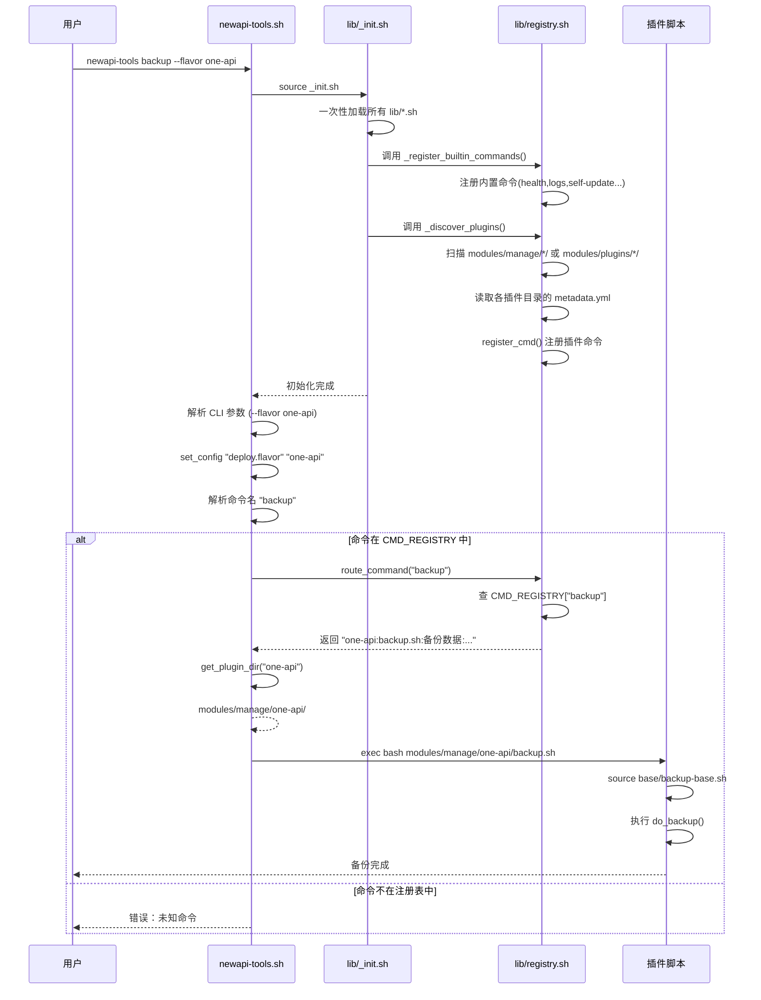
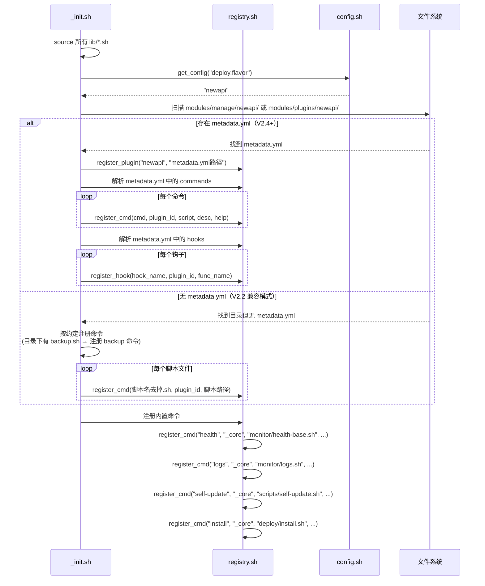
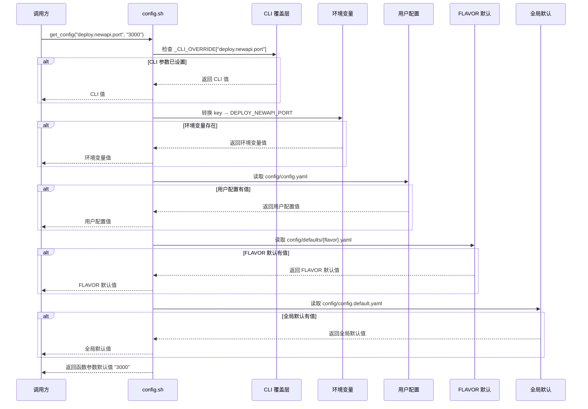
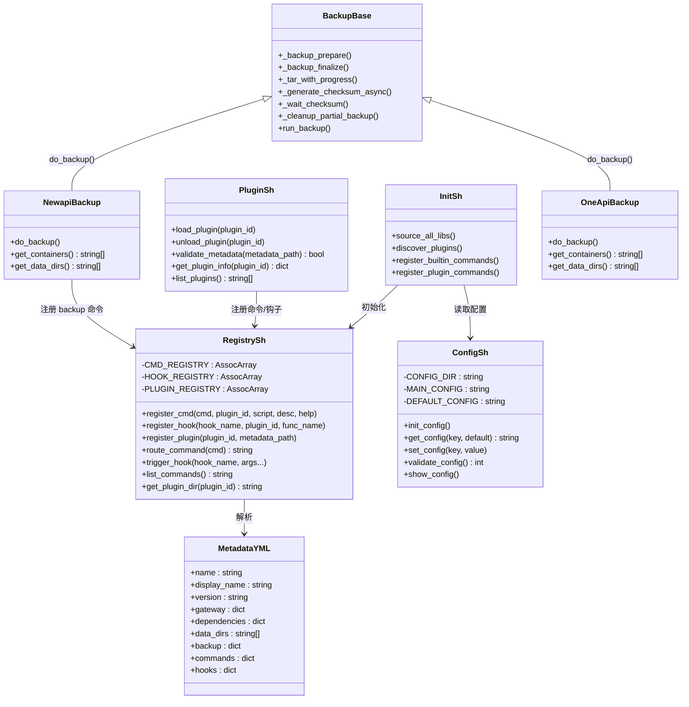

# NewAPI Tools 系统架构设计文档：V2.x → V3.0 渐进演进

> 版本：v1.0  
> 日期：2026-07  
> 作者：架构师（Bob）  
> 状态：草案  
> 前序文档：`docs/PRD-ARCHITECTURE-V2-V3.md`

---

## 一、当前架构问题分析

### 1.1 模块耦合 — manage/ 是 NewAPI 的私域

**问题定位**：

| 文件 | 行号 | 硬编码内容 | 影响 |
|------|------|-----------|------|
| `modules/manage/backup.sh` | L204 | `docker exec -i mysql bash -c ... mysqldump ... newapi` | One API 用 SQLite 没有 mysql 容器，直接报错 |
| `modules/manage/backup.sh` | L33 | `newapi_db_${timestamp}.sql` | 文件名硬编码 newapi |
| `modules/manage/backup.sh` | L238 | `_tar_with_progress "$data_file" "$NEWAPI_HOME" "data" "npm"` | One API 没有 npm，Sub2API 端口 8080 |
| `modules/manage/restore.sh` | L89 | `docker exec -i mysql bash -c ... mysqldump` | 同上 |
| `modules/manage/restore.sh` | L137 | `docker exec -i mysql bash -c ... mysql -uroot newapi` | 同上 |
| `modules/manage/update.sh` | L61 | `docker inspect --format='{{.Image}}' new-api` | 容器名硬编码 |
| `modules/manage/update.sh` | L77 | `$DOCKER_COMPOSE_CMD pull new-api` | 服务名硬编码 |
| `modules/manage/update.sh` | L126 | `docker tag "$OLD_IMAGE_ID" calciumion/new-api:latest` | 镜像名硬编码 |
| `modules/manage/reinstall.sh` | L72 | `for container in new-api mysql redis npm` | 容器列表硬编码 |
| `modules/manage/uninstall.sh` | L44 | `for container in new-api mysql redis npm` | 同上 |
| `modules/manage/doctor.sh` | L338 | `local containers=("new-api" "mysql" "redis" "npm")` | 诊断逻辑完全 NewAPI 化 |
| `modules/manage/config.sh` | 全文 | 仅配置 NewAPI 参数 | 其他 FLAVOR 没有配置入口 |

**量化影响**：7 个 manage/ 脚本 × 约 2700 行代码，100% 只能跑在 NewAPI 上。粗估 500+ 用户中，用 One API / Sub2API 的用户运行 `newapi-tools backup` 必报错。

### 1.2 路由硬编码 — 加命令得改主入口

**问题定位**：

| 文件 | 行号 | 问题描述 |
|------|------|---------|
| `newapi-tools.sh` | L48-79 | `route_command()` 是硬编码 `case` 语句，共 10 个分支 |
| `newapi-tools.sh` | L88-101 | `--help` 文本也是硬编码，和路由表双份维护 |
| `newapi-tools.sh` | L120-131 | 每个命令的帮助文本又硬编码了一遍 |
| `newapi-tools.sh` | L178-280 | 交互菜单的 case 语句又第三份硬编码 |

**量化影响**：新增一个命令需要改 `route_command()` + 帮助文本 + 交互菜单 = 至少 3 处。每次加 FLAVOR 专属命令（如 `newapi-tools one-api-config`）还得加 FLAVOR 判断。

### 1.3 依赖加载混乱 — security.sh 加载 5-6 次

**问题定位**：

| 文件 | 行号 | 加载方式 |
|------|------|---------|
| `lib/common.sh` | L19-28 | 先检查 `_SECURITY_SH_LOADED` 守卫，再 source security.sh |
| `lib/config.sh` | L7-13 | 再次检查并 source common.sh + security.sh |
| `lib/state.sh` | L7-13 | 再次检查并 source common.sh + security.sh |
| `modules/deploy/install.sh` | L15-21 | 又 source common.sh + security.sh |
| `newapi-tools.sh` | L12-24 | 逐个 source 7 个 lib 文件，每个 lib 内又交叉 source |

**问题本质**：没有一个统一的 `_init.sh` 入口，每个文件都"防御性地 source 自己的依赖"，导致：
- 一次命令执行中 `security.sh` 被加载 5-6 次（靠守卫变量 `_SECURITY_SH_LOADED` 防重入）
- 加载顺序不可控 — common.sh 里提前定义了简易版 `log_info`（L11-16），后面又被完整版覆盖（L102-107）
- 子脚本各自算路径：有的用 `${TOOLKIT_ROOT}/lib/`，有的用 `$SCRIPT_DIR/../lib/`，有的用 `$BASE_DIR/lib/`

**量化影响**：9 个 lib 文件中有 6 个包含交叉 source 逻辑，约 40 行重复的守卫+路径计算代码。

### 1.4 配置双轨制 — env.sh 和 config.sh 并存

**问题定位**：

| 文件 | 行号 | 问题 |
|------|------|------|
| `lib/env.sh` | 全文(90行) | V1.0 遗留，读取 `toolkit.conf`（key=value 格式），仅支持 5 个变量 |
| `lib/config.sh` | 全文(344行) | V2.0 新增，读取 `config.yaml`（YAML 格式），支持分层配置 |
| `newapi-tools.sh` | L14 | 同时 source 两个文件，优先级不明 |
| `lib/env.sh` | L87 | `load_config` 在 source 时自动执行，但 newapi-tools.sh 已经 source 过 config.sh 了 |

**实际影响**：用户改了 `config.yaml` 里的 `NEWAPI_HOME`，但 `env.sh` 的 `toolkit.conf` 里还是旧值，两个值打架。当前靠"env.sh 保存了环境变量再恢复"的黑魔法兜底（L70-76），但这本质上是补丁不是方案。

### 1.5 已知 Bug

| 文件 | 行号 | Bug | 严重性 |
|------|------|-----|--------|
| `modules/deploy/ssl-proxy.sh` | L158 | docker-compose.yml 的 heredoc 内 `${SUB2API_PORT}` 未正确转义 | 高（Sub2API 部署失败） |
| `modules/manage/doctor.sh` | L36-90 | `_run_diag_bg` 和 `_cleanup_diag_tmp` 函数重复声明（L36-50 和 L82-101） | 中（bash 不会报错但逻辑不可控） |
| `modules/manage/doctor.sh` | L557-560 | `_init_parallel_diag()` 在函数 `main()` 内定义，然后又调用自身 | 低（能跑但不规范） |
| `modules/deploy/one-api/install.sh` | L241 | docker-compose.yml 中 MySQL 环境变量 `${SQL_DSN#*password=}` 无法正确解析 | 高（One API + MySQL 模式部署失败） |

---

## 二、目标架构设计

### 2.1 V2.x 目标架构（渐进改进，每版可发布）

```
newapi-tools.sh（加载 _init.sh → 查注册表 → 路由）
├── lib/
│   ├── _init.sh          ← 【新增】统一初始化入口，一次性加载全部 lib
│   ├── common.sh         ← 保持，删除交叉 source
│   ├── security.sh       ← 保持，删除守卫变量（_init.sh 保证只加载一次）
│   ├── state.sh          ← 保持，删除交叉 source
│   ├── config.sh         ← 保持，增强 get_config 支持 FLAVOR 键
│   ├── ui.sh             ← 保持不变
│   ├── smart-defaults.sh ← 保持不变
│   ├── mode.sh           ← 保持不变
│   ├── npm-api.sh        ← 保持不变
│   ├── env.sh            ← 【V2.1 改为代理模式】转发到 config.sh，打印弃用警告
│   ├── registry.sh       ← 【V2.2 新增】命令注册表（declare -A）
│   └── os_adapter.sh     ← 【V2.3 新增】OS 适配层
├── modules/
│   ├── init/             ← 保持不变
│   ├── deploy/           ← 已有 FLAVOR 子目录，保持
│   │   ├── install.sh    ← 改为调用注册表路由，去掉硬编码 case
│   │   ├── ssl-proxy.sh  ← 修 Bug
│   │   ├── newapi/       ← 保持
│   │   ├── one-api/      ← 保持
│   │   └── sub2api/      ← 保持
│   ├── manage/           ← 【V2.2 拆分】
│   │   ├── base/         ← 【新增】通用逻辑（备份压缩/校验/清理等）
│   │   │   ├── backup-base.sh
│   │   │   ├── restore-base.sh
│   │   │   └── update-base.sh
│   │   ├── newapi/       ← 【新增】NewAPI 专属脚本
│   │   │   ├── backup.sh
│   │   │   ├── restore.sh
│   │   │   ├── update.sh
│   │   │   ├── reinstall.sh
│   │   │   ├── uninstall.sh
│   │   │   └── config.sh
│   │   ├── one-api/      ← 【新增】One API 专属脚本
│   │   │   ├── backup.sh
│   │   │   ├── restore.sh
│   │   │   ├── update.sh
│   │   │   └── config.sh
│   │   └── sub2api/      ← 【新增】Sub2API 专属脚本
│   │       ├── backup.sh
│   │       ├── restore.sh
│   │       └── config.sh
│   └── monitor/          ← 【V2.2 拆分】
│       ├── health-base.sh ← 【新增】通用健康检查框架
│       └── logs.sh        ← 保持（日志查看不区分 FLAVOR）
└── scripts/              ← 保持不变
```

### 2.2 V3.0 目标架构（插件式、模块化）

```
newapi-tools.sh（极简：加载 core + 查注册表 + 路由）
├── lib/core/                    ← 不可插拔
│   ├── _init.sh                 ← 统一初始化
│   ├── common.sh                ← 基础函数
│   ├── security.sh              ← 安全工具
│   ├── state.sh                 ← 状态管理
│   ├── config.sh                ← 配置管理
│   ├── ui.sh                    ← UI 组件
│   ├── smart-defaults.sh        ← 智能默认值
│   ├── mode.sh                  ← 新手/专家模式
│   ├── npm-api.sh               ← NPM API
│   ├── registry.sh              ← 命令注册表
│   ├── plugin.sh                ← 【新增】插件框架
│   └── os_adapter.sh            ← 【新增】OS 适配层
├── modules/core/                ← 不可插拔（通用框架）
│   ├── init/                    ← 环境初始化
│   ├── deploy/ssl-proxy.sh      ← 通用 SSL 配置
│   ├── manage/
│   │   ├── backup-base.sh       ← 通用备份框架
│   │   ├── restore-base.sh      ← 通用恢复框架
│   │   ├── update-base.sh       ← 通用更新框架
│   │   └── config-base.sh       ← 通用配置框架
│   └── monitor/
│       ├── health-base.sh       ← 通用健康检查框架
│       └── logs.sh              ← 通用日志查看
├── modules/plugins/             ← 可插拔
│   ├── newapi/
│   │   ├── metadata.yml         ← 插件元数据
│   │   ├── install.sh           ← NewAPI 安装
│   │   ├── backup.sh            ← NewAPI 备份（实现差异）
│   │   ├── restore.sh           ← NewAPI 恢复
│   │   ├── update.sh            ← NewAPI 更新
│   │   ├── reinstall.sh         ← NewAPI 重装
│   │   ├── uninstall.sh         ← NewAPI 卸载
│   │   ├── config.sh            ← NewAPI 配置
│   │   └── doctor.sh            ← NewAPI 诊断
│   ├── one-api/
│   │   ├── metadata.yml
│   │   ├── install.sh
│   │   ├── backup.sh
│   │   ├── restore.sh
│   │   ├── update.sh
│   │   └── config.sh
│   └── sub2api/
│       ├── metadata.yml
│       ├── install.sh
│       ├── backup.sh
│       ├── restore.sh
│       └── config.sh
└── scripts/                     ← 工具脚本
    ├── encrypt-config.sh
    ├── self-update.sh
    └── verify-deployment.sh
```

### 2.3 V2.x → V3.0 演进映射

| V2.x 版本 | 架构变化 | 对应 V3.0 的哪部分 |
|-----------|---------|-------------------|
| V2.0.8 | 修 Bug（ssl-proxy/doctor/unit-test） | 直接进入 V3.0 代码库 |
| V2.1 | `_init.sh` + env.sh 代理 + 错误码 | `lib/core/_init.sh` + 错误码体系 |
| V2.2 | manage/ 按 FLAVOR 拆分 + registry.sh | `modules/plugins/*/` + `lib/core/registry.sh` |
| V2.3 | os_adapter.sh + 多实例 + 监控增强 | `lib/core/os_adapter.sh` + 新运维功能 |
| V2.4 | plugin.sh + metadata.yml 规范 | `lib/core/plugin.sh` + `metadata.yml`（**V2.4 = V3.0-alpha**）|
| V3.0 | 目录重组（lib/ → lib/core/，manage/newapi/ → plugins/newapi/） | 最终目录结构 |

**关键洞察**：V2.4 到 V3.0 的变化**只是目录搬家**，代码逻辑完全不变。一条 `mv` 命令搞定。这就是渐进式演进的好处。

---

## 三、文件列表及相对路径

### 3.1 V2.0.8（Bug 修复）

| 操作 | 文件路径 | 说明 |
|------|---------|------|
| 修改 | `modules/deploy/sub2api/install.sh` | 修 docker-compose.yml 中 `${SUB2API_PORT}` 未转义问题 |
| 修改 | `modules/deploy/one-api/install.sh` | 修 MySQL 环境变量解析错误 |
| 修改 | `modules/manage/doctor.sh` | 删除重复声明的函数（L82-134） |
| 修改 | `test/unit-test.sh` | 修 state.sh 测试后进程挂起问题 |

### 3.2 V2.1（基础设施统一）

| 操作 | 文件路径 | 说明 |
|------|---------|------|
| 新增 | `lib/_init.sh` | 统一初始化入口，一次性 source 所有 lib |
| 修改 | `lib/common.sh` | 删除交叉 source security.sh 的逻辑（L19-28） |
| 修改 | `lib/config.sh` | 删除交叉 source（L7-13） |
| 修改 | `lib/state.sh` | 删除交叉 source（L7-13） |
| 修改 | `lib/env.sh` | 改为代理模式：转发到 config.sh，source 时打印弃用警告 |
| 修改 | `newapi-tools.sh` | 改为 `source _init.sh`，删除逐个 source |
| 修改 | `modules/deploy/install.sh` | 改用 `_init.sh` 加载（删除 L15-21 的手动 source） |
| 修改 | `modules/deploy/newapi/install.sh` | 同上 |
| 修改 | `modules/deploy/one-api/install.sh` | 同上 |
| 修改 | `modules/deploy/sub2api/install.sh` | 同上 |

### 3.3 V2.2（模块解耦 + 路由注册化）

| 操作 | 文件路径 | 说明 |
|------|---------|------|
| 新增 | `lib/registry.sh` | 命令注册表（declare -A CMD_REGISTRY, HOOK_REGISTRY） |
| 新增 | `modules/manage/base/backup-base.sh` | 从 backup.sh 抽取通用逻辑（压缩/校验/清理） |
| 新增 | `modules/manage/base/restore-base.sh` | 从 restore.sh 抽取通用逻辑（解压/校验/回滚框架） |
| 新增 | `modules/manage/base/update-base.sh` | 从 update.sh 抽取通用逻辑（版本记录/健康检查/回滚） |
| 新增 | `modules/manage/newapi/backup.sh` | NewAPI 专属备份（MySQL dump + data + npm） |
| 新增 | `modules/manage/newapi/restore.sh` | NewAPI 专属恢复 |
| 新增 | `modules/manage/newapi/update.sh` | NewAPI 专属更新 |
| 新增 | `modules/manage/newapi/reinstall.sh` | NewAPI 专属重装 |
| 新增 | `modules/manage/newapi/uninstall.sh` | NewAPI 专属卸载 |
| 新增 | `modules/manage/newapi/config.sh` | NewAPI 专属配置 |
| 新增 | `modules/manage/one-api/backup.sh` | One API 专属备份（SQLite 文件拷贝 + data） |
| 新增 | `modules/manage/one-api/restore.sh` | One API 专属恢复 |
| 新增 | `modules/manage/one-api/update.sh` | One API 专属更新 |
| 新增 | `modules/manage/one-api/config.sh` | One API 专属配置 |
| 新增 | `modules/manage/sub2api/backup.sh` | Sub2API 专属备份 |
| 新增 | `modules/manage/sub2api/restore.sh` | Sub2API 专属恢复 |
| 新增 | `modules/manage/sub2api/config.sh` | Sub2API 专属配置 |
| 新增 | `modules/monitor/health-base.sh` | 从 health.sh 抽取通用框架 |
| 修改 | `newapi-tools.sh` | 改用注册表路由，删除硬编码 case |
| 修改 | `modules/deploy/install.sh` | 改用注册表路由 |
| 删除 | `modules/manage/backup.sh` | 移入 newapi/ 子目录 |
| 删除 | `modules/manage/restore.sh` | 同上 |
| 删除 | `modules/manage/update.sh` | 同上 |
| 删除 | `modules/manage/reinstall.sh` | 同上 |
| 删除 | `modules/manage/uninstall.sh` | 同上 |
| 删除 | `modules/manage/config.sh` | 同上 |
| 删除 | `modules/manage/doctor.sh` | 移入 newapi/ 子目录 |
| 删除 | `modules/monitor/health.sh` | 移入 newapi/ + 改用 health-base.sh |

### 3.4 V2.3（高级运维功能）

| 操作 | 文件路径 | 说明 |
|------|---------|------|
| 新增 | `lib/os_adapter.sh` | OS 适配层（包管理器/Docker 安装/服务管理） |
| 新增 | `modules/manage/instances.sh` | 多实例管理 |
| 新增 | `modules/monitor/alert.sh` | 告警规则引擎 |
| 修改 | `modules/init/docker.sh` | 使用 os_adapter.sh |

### 3.5 V2.4（插件系统 MVP）

| 操作 | 文件路径 | 说明 |
|------|---------|------|
| 新增 | `lib/plugin.sh` | 插件框架（加载/卸载/校验/生命周期） |
| 新增 | `modules/plugins/*/metadata.yml` | 每个插件的元数据声明 |

### 3.6 V3.0（目录重组 + 正式版）

| 操作 | 说明 |
|------|------|
| `mv lib/ lib/core/` | 核心库归入 core/ |
| `mv modules/manage/newapi/ modules/plugins/newapi/` | 插件归入 plugins/ |
| `mv modules/deploy/newapi/install.sh modules/plugins/newapi/install.sh` | deploy 入口归入插件 |
| 同理 one-api, sub2api |  |

---

## 四、数据结构和接口

### 4.1 插件 metadata.yml 完整 Schema

```yaml
# metadata.yml — 插件元数据声明文件
# 位置：modules/plugins/<flavor>/metadata.yml

# ===== 必填字段 =====
name: "newapi"                    # 插件唯一标识（小写+连字符，与目录名一致）
display_name: "NewAPI"            # 用户可见名称
version: "3.0.0"                  # 插件版本（semver）
description: "NewAPI AI 网关管理"  # 一句话描述
author: "newapi-tools-team"       # 作者
min_toolkit_version: "2.4.0"      # 最低工具集版本要求

# 网关运行时配置
gateway:
  container_name: "new-api"       # 主容器名
  image: "calciumion/new-api:latest"  # Docker 镜像
  port: 3000                      # 容器内监听端口
  health_check_path: "/api/status" # 健康检查路径
  network_name: "newapi-network"   # Docker 网络名

# 依赖服务
dependencies:
  mysql:
    required: true                 # 是否必需
    container_name: "mysql"
    image: "mysql:8.0"
    database: "newapi"
  redis:
    required: true
    container_name: "redis"
    image: "redis:7.2"
  npm:
    required: true
    container_name: "npm"
    image: "jc21/nginx-proxy-manager:latest"

# 数据目录（相对于 $NEWAPI_HOME）
data_dirs:
  - "data"
  - "npm"
  - "mysql"

# 备份配置
backup:
  has_database: true               # 是否有数据库需要导出
  database_type: "mysql"           # mysql | sqlite | none
  database_name: "newapi"          # 数据库名
  database_container: "mysql"      # 数据库容器名

# ===== 可选字段 =====
homepage: "https://github.com/Calcium-Ion/new-api"
license: "MIT"
tags: ["ai-gateway", "openai-compatible"]

# 插件注册的命令（自动写入注册表）
commands:
  install:                        # 命令名
    script: "install.sh"          # 相对于插件目录的脚本路径
    description: "部署 NewAPI"     # 命令描述
    help: "部署 NewAPI 全家桶 [--flavor newapi]"
  backup:
    script: "backup.sh"
    description: "备份数据"
    help: "手动备份数据库与核心数据"
  restore:
    script: "restore.sh"
    description: "恢复数据"
    help: "从备份文件恢复数据"
  update:
    script: "update.sh"
    description: "更新版本"
    help: "更新 NewAPI 镜像（含自动备份+回滚）"
  reinstall:
    script: "reinstall.sh"
    description: "重新安装"
    help: "重装 NewAPI"
  uninstall:
    script: "uninstall.sh"
    description: "卸载"
    help: "彻底卸载 NewAPI"
  config:
    script: "config.sh"
    description: "配置"
    help: "NewAPI 配置向导"
  doctor:
    script: "doctor.sh"
    description: "诊断"
    help: "NewAPI 系统诊断"

# 插件注册的钩子（自动写入钩子注册表）
hooks:
  post_install:                    # 钩子名
    function: "post_install_hook"   # 钩子函数名
    priority: 10                    # 优先级（数字越小越先执行，默认 10）
  pre_update:
    function: "pre_update_hook"
    priority: 10
  post_update:
    function: "post_update_hook"
    priority: 20
  health_check:
    function: "health_check_hook"
    priority: 10
```

### 4.2 注册表 API

```bash
# ========== lib/registry.sh ==========

# --- 全局注册表 ---
declare -gA CMD_REGISTRY     # 命令注册表：key=命令名, value="插件ID:脚本路径:描述:帮助"
declare -gA HOOK_REGISTRY    # 钩子注册表：key=钩子名, value="插件ID:函数名:优先级"
declare -gA PLUGIN_REGISTRY  # 插件注册表：key=插件ID, value="metadata.yml路径"

# --- 注册命令 ---
# 用法: register_cmd "命令名" "插件ID" "脚本路径" "描述" "帮助文本"
# 示例: register_cmd "backup" "newapi" "backup.sh" "备份数据" "手动备份..."
register_cmd() {
    local cmd="$1"
    local plugin_id="$2"
    local script="$3"
    local desc="$4"
    local help_text="$5"
    
    if [[ -n "${CMD_REGISTRY[$cmd]:-}" ]]; then
        log_warn "命令 '$cmd' 已被注册，将被插件 '$plugin_id' 覆盖"
    fi
    CMD_REGISTRY["$cmd"]="${plugin_id}:${script}:${desc}:${help_text}"
    log_debug "注册命令: $cmd → $plugin_id/$script"
}

# --- 注册钩子 ---
# 用法: register_hook "钩子名" "插件ID" "函数名" [优先级]
# 示例: register_hook "post_install" "newapi" "newapi_post_install" 10
register_hook() {
    local hook_name="$1"
    local plugin_id="$2"
    local func_name="$3"
    local priority="${4:-10}"    # 默认优先级 10
    
    HOOK_REGISTRY["$hook_name"]="${plugin_id}:${func_name}:${priority}"
    log_debug "注册钩子: $hook_name → $plugin_id:$func_name (priority=$priority)"
}

# --- 注册插件 ---
# 用法: register_plugin "插件ID" "metadata.yml路径"
register_plugin() {
    local plugin_id="$1"
    local metadata_path="$2"
    
    if [[ ! -f "$metadata_path" ]]; then
        log_error "插件元数据文件不存在: $metadata_path"
        return 1
    fi
    PLUGIN_REGISTRY["$plugin_id"]="$metadata_path"
    log_info "注册插件: $plugin_id"
}

# --- 路由命令 ---
# 用法: route_command "命令名"
# 返回: 脚本路径（stdout），未找到返回空
route_command() {
    local cmd="$1"
    local entry="${CMD_REGISTRY[$cmd]:-}"
    
    if [[ -z "$entry" ]]; then
        return 1
    fi
    
    # 解析 entry: "插件ID:脚本路径:描述:帮助"
    local plugin_id="${entry%%:*}"
    local rest="${entry#*:}"
    local script="${rest%%:*}"
    
    # 根据插件ID查找插件目录
    local plugin_dir
    plugin_dir=$(get_plugin_dir "$plugin_id")
    
    echo "${plugin_dir}/${script}"
    return 0
}

# --- 获取插件目录 ---
get_plugin_dir() {
    local plugin_id="$1"
    # V2.x: modules/manage/<plugin_id>/ 或 modules/deploy/<plugin_id>/
    # V3.0: modules/plugins/<plugin_id>/
    # 兼容两种路径
    local dir
    for search_dir in \
        "${MODULES_DIR}/manage/${plugin_id}" \
        "${MODULES_DIR}/deploy/${plugin_id}" \
        "${MODULES_DIR}/plugins/${plugin_id}"; do
        if [[ -d "$search_dir" ]]; then
            echo "$search_dir"
            return 0
        fi
    done
    return 1
}

# --- 触发钩子 ---
# 用法: trigger_hook "钩子名" [参数...]
trigger_hook() {
    local hook_name="$1"
    shift
    local entry="${HOOK_REGISTRY[$hook_name]:-}"
    
    if [[ -z "$entry" ]]; then
        return 0  # 没有注册钩子，静默返回
    fi
    
    local func_name="${entry#*:}"
    if command -v "$func_name" &>/dev/null; then
        "$func_name" "$@"
    fi
}

# --- 获取当前 FLAVOR ---
get_current_flavor() {
    get_config "deploy.flavor" "newapi"
}

# --- 列出所有命令（用于 --help）---
list_commands() {
    for cmd in "${!CMD_REGISTRY[@]}"; do
        local entry="${CMD_REGISTRY[$cmd]}"
        local plugin_id="${entry%%:*}"
        local rest="${entry#*:}"
        local desc=$(echo "$rest" | cut -d':' -f2)
        printf "  %-15s %s\n" "$cmd" "$desc"
    done | sort
}
```

### 4.3 插件接口（必须/可选实现的函数）

每个插件脚本**必须**在 source 时注册自身命令。插件脚本可以定义以下函数：

| 函数名 | 必须/可选 | 说明 | 对应 base 脚本 |
|--------|----------|------|--------------|
| `do_backup()` | 备份脚本必须 | 执行 FLAVOR 专属备份逻辑 | `backup-base.sh` 调用 |
| `do_restore()` | 恢复脚本必须 | 执行 FLAVOR 专属恢复逻辑 | `restore-base.sh` 调用 |
| `do_update()` | 更新脚本必须 | 执行 FLAVOR 专属更新逻辑 | `update-base.sh` 调用 |
| `do_install()` | 安装脚本必须 | 执行 FLAVOR 专属安装逻辑 | 直接调用 |
| `do_uninstall()` | 卸载脚本必须 | 执行 FLAVOR 专属卸载逻辑 | 直接调用 |
| `do_config()` | 配置脚本可选 | 执行 FLAVOR 专属配置 | 直接调用 |
| `do_diagnose()` | 诊断脚本可选 | 执行 FLAVOR 专属诊断 | doctor.sh 调用 |
| `get_containers()` | 可选 | 返回该 FLAVOR 的容器名列表 | health.sh / doctor.sh 调用 |
| `get_data_dirs()` | 可选 | 返回该 FLAVOR 的数据目录列表 | backup-base.sh 调用 |
| `health_check()` | 可选 | FLAVOR 专属健康检查 | health-base.sh 调用 |

**base 脚本调用模式**：

```bash
# backup-base.sh 的核心逻辑
run_backup() {
    local flavor=$(get_current_flavor)
    local plugin_script
    plugin_script=$(get_plugin_dir "$flavor")/backup.sh
    
    # 1. base 通用逻辑：创建备份目录、生成时间戳
    _backup_prepare
    
    # 2. 调用插件的 do_backup()
    source "$plugin_script"
    do_backup
    
    # 3. base 通用逻辑：异步校验、清理过期备份、发送通知
    _backup_finalize
}
```

### 4.4 配置层级

```
优先级（从高到低）：
  CLI 参数         ← --port 3000     最高
  环境变量         ← NEWAPI_PORT=3000
  用户配置         ← config/config.yaml
  FLAVOR 默认配置  ← config/defaults/newapi.yaml  【新增】
  全局默认配置     ← config/config.default.yaml   最低
```

**FLAVOR 默认配置文件**（V2.2 新增）：

```yaml
# config/defaults/newapi.yaml
deploy:
  newapi:
    image: "calciumion/new-api:latest"
    port: 3000
  mysql:
    image: "mysql:8.0"
    database: "newapi"
  redis:
    image: "redis:7.2"
  npm:
    image: "jc21/nginx-proxy-manager:latest"
    port: 81
```

```yaml
# config/defaults/one-api.yaml
deploy:
  one_api:
    image: "justsong/one-api:latest"
    port: 3000
    sqlite_enabled: true
  redis:
    image: "redis:7.2"
  npm:
    image: "jc21/nginx-proxy-manager:latest"
    port: 81
```

```yaml
# config/defaults/sub2api.yaml
deploy:
  sub2api:
    image: "weishaw/sub2api:latest"
    port: 8080
  npm:
    image: "jc21/nginx-proxy-manager:latest"
    port: 81
```

**`get_config()` 改造**（V2.2）：

```bash
get_config() {
    local key="$1"
    local default_value="${2:-}"
    local value=""
    
    # 0. CLI 参数（最高优先级，由调用方设置 _CLI_OVERRIDE）
    if [[ -n "${_CLI_OVERRIDE[$key]:-}" ]]; then
        echo "${_CLI_OVERRIDE[$key]}"
        return 0
    fi
    
    # 1. 环境变量
    local env_var
    env_var=$(echo "$key" | tr '.' '_' | tr '[:lower:]' '[:upper:]')
    if [[ -n "${!env_var:-}" ]]; then
        echo "${!env_var}"
        return 0
    fi
    
    # 2. 用户配置 config.yaml
    value=$(_read_yaml "$MAIN_CONFIG" "$key")
    [[ -n "$value" ]] && { echo "$value"; return 0; }
    
    # 3. FLAVOR 默认配置（V2.2 新增）
    local flavor
    flavor=$(get_current_flavor 2>/dev/null || echo "newapi")
    local flavor_defaults="${CONFIG_DIR}/defaults/${flavor}.yaml"
    if [[ -f "$flavor_defaults" ]]; then
        value=$(_read_yaml "$flavor_defaults" "$key")
        [[ -n "$value" ]] && { echo "$value"; return 0; }
    fi
    
    # 4. 全局默认配置
    value=$(_read_yaml "$DEFAULT_CONFIG" "$key")
    [[ -n "$value" ]] && { echo "$value"; return 0; }
    
    # 5. 函数参数默认值
    echo "$default_value"
}
```

---

## 五、程序调用流程

### 5.1 命令路由流程



### 5.2 插件加载流程



### 5.3 配置读取流程



---

## 六、任务列表

### V2.0.8 — Bug 止血（预估 1-2 天）

| ID | 任务名 | 描述 | 前置依赖 | 涉及文件 |
|----|--------|------|---------|---------|
| T01 | 修复 Sub2API 部署 Bug | docker-compose.yml 中 `${SUB2API_PORT}` 在 heredoc 内被当前 shell 展开，需要转义 | 无 | `modules/deploy/sub2api/install.sh` |
| T02 | 修复 One API + MySQL 部署 Bug | MySQL 环境变量 `${SQL_DSN#*password=}` 无法正确解析 | 无 | `modules/deploy/one-api/install.sh` |
| T03 | 修复 doctor.sh 重复声明 | 删除 L82-134 的重复函数声明 | 无 | `modules/manage/doctor.sh` |
| T04 | 修复 unit-test.sh 挂起 | state.sh 测试后进程不退出 | 无 | `test/unit-test.sh` |

### V2.1 — 基础设施统一（预估 3-5 天）

| ID | 任务名 | 描述 | 前置依赖 | 涉及文件 |
|----|--------|------|---------|---------|
| T05 | 创建 _init.sh 统一入口 | 新建 lib/_init.sh，一次性加载所有 lib，删除各 lib 内的交叉 source | 无 | `lib/_init.sh`(新), `lib/common.sh`, `lib/config.sh`, `lib/state.sh`, `lib/security.sh`, `newapi-tools.sh` |
| T06 | env.sh 改为代理模式 | lib/env.sh 改为转发到 config.sh + 打印弃用警告 | T05 | `lib/env.sh`, `lib/config.sh` |
| T07 | 统一子脚本加载方式 | 所有子脚本改为先 source `_init.sh`，删除各自的手动 source 链 | T05 | `modules/deploy/install.sh`, `modules/deploy/newapi/install.sh`, `modules/deploy/one-api/install.sh`, `modules/deploy/sub2api/install.sh` |

### V2.2 — 模块解耦 + 路由注册化（预估 5-8 天）

| ID | 任务名 | 描述 | 前置依赖 | 涉及文件 |
|----|--------|------|---------|---------|
| T08 | 实现 registry.sh 命令注册表 | 新建 lib/registry.sh，实现 register_cmd/register_hook/route_command 等函数 | T05 | `lib/registry.sh`(新) |
| T09 | 改造 newapi-tools.sh 使用注册表 | 删除硬编码 case 路由，改用注册表查找；help 文本也从注册表生成 | T08 | `newapi-tools.sh` |
| T10 | 抽取 manage/base/ 通用逻辑 | 从 backup/restore/update 中抽取压缩/校验/回滚等通用函数到 base 脚本 | T05 | `modules/manage/base/backup-base.sh`(新), `modules/manage/base/restore-base.sh`(新), `modules/manage/base/update-base.sh`(新) |
| T11 | 拆分 manage/ 按 FLAVOR 子目录 | 创建 manage/newapi/, manage/one-api/, manage/sub2api/，各写专属脚本 | T10 | `modules/manage/newapi/`(新目录+文件), `modules/manage/one-api/`(新), `modules/manage/sub2api/`(新) |
| T12 | 实现 FLAVOR 默认配置 | 创建 config/defaults/*.yaml，改造 get_config() 支持 FLAVOR 层级 | T05 | `config/defaults/newapi.yaml`(新), `config/defaults/one-api.yaml`(新), `config/defaults/sub2api.yaml`(新), `lib/config.sh` |
| T13 | 改造 health.sh 为 health-base.sh | 抽取通用健康检查框架，FLAVOR 专属检查由插件实现 | T10 | `modules/monitor/health-base.sh`(新), `modules/manage/newapi/doctor.sh`(新) |

### V2.3 — 高级运维功能（预估 5-7 天）

| ID | 任务名 | 描述 | 前置依赖 | 涉及文件 |
|----|--------|------|---------|---------|
| T14 | 实现 os_adapter.sh | 抽取 OS 差异逻辑（包管理器/Docker 安装/服务管理） | T05 | `lib/os_adapter.sh`(新), `modules/init/docker.sh` |
| T15 | 实现多实例管理 | 支持 `newapi-tools instances` 查看和管理多个网关实例 | T11 | `modules/manage/instances.sh`(新) |
| T16 | 实现监控增强 | 告警规则引擎 + Webhook 通知 | T13 | `modules/monitor/alert.sh`(新) |

### V2.4 — 插件系统 MVP（预估 5-7 天）

| ID | 任务名 | 描述 | 前置依赖 | 涉及文件 |
|----|--------|------|---------|---------|
| T17 | 实现 plugin.sh 插件框架 | 加载/卸载/校验/生命周期管理 | T08 | `lib/plugin.sh`(新) |
| T18 | 编写 metadata.yml 规范 | 为 newapi/one-api/sub2api 各写一份 metadata.yml | T17 | `modules/manage/newapi/metadata.yml`(新), `modules/manage/one-api/metadata.yml`(新), `modules/manage/sub2api/metadata.yml`(新) |
| T19 | 改造 _init.sh 支持从 metadata.yml 自动注册 | _init.sh 启动时扫描插件目录、解析 metadata.yml、自动注册命令和钩子 | T17, T18 | `lib/_init.sh`, `lib/plugin.sh` |

### V3.0 — 目录重组 + 正式版（预估 2-3 天）

| ID | 任务名 | 描述 | 前置依赖 | 涉及文件 |
|----|--------|------|---------|---------|
| T20 | 目录重组 | lib/ → lib/core/，manage/newapi/ → plugins/newapi/，所有 source 路径更新 | T19 | 全部文件 |

---

## 七、依赖包列表

### 7.1 当前已有的外部依赖

| 包 | 用途 | 是否必须 | 说明 |
|----|------|---------|------|
| `jq` | JSON 解析（state.sh, npm-api.sh） | 强烈推荐 | 无 jq 时降级到 sed/grep，但功能受限 |
| `yq` | YAML 读写（config.sh） | 推荐 | 无 yq 时降级到 python3 或 grep |
| `python3` + PyYAML | YAML 读写降级方案 | 可选 | 当 yq 不可用时使用 |
| `docker` + `docker compose` | 容器管理 | 必须 | 核心依赖 |
| `curl` | HTTP 请求（NPM API、Webhook） | 必须 | |
| `pv` | 进度条显示 | 可选 | 备份/恢复时的压缩进度条 |
| `pigz` | 并行压缩 | 可选 | 加速备份压缩 |

### 7.2 V3.0 新增依赖

| 包 | 用途 | 是否必须 | 说明 |
|----|------|---------|------|
| 无新增 | — | — | 纯 Shell 约束，不引入新运行时依赖 |

**核心原则**：不引入 Python/Node 等运行时依赖。metadata.yml 的解析用 Shell + yq/jq 完成（项目已有 yq 依赖）。

---

## 八、共享知识（跨文件约定）

### 8.1 命名规范

```
函数名：    snake_case，模块前缀        例：backup_do_mysql_dump(), registry_register_cmd()
变量名：    UPPER_CASE 全局/常量        例：TOOLKIT_ROOT, MODULES_DIR
           lower_case 局部变量          例：local backup_dir, local timestamp
           _前缀表示内部函数/变量       例：_backup_prepare(), _SECURITY_SH_LOADED
文件名：    kebab-case                  例：backup-base.sh, health-base.sh
目录名：    kebab-case                  例：one-api/, smart-defaults.sh
环境变量：  UPPER_CASE + 模块前缀       例：NEWAPI_HOME, DEPLOY_FLAVOR, DEBUG
错误码：    ERR_模块_序号               例：ERR_BACKUP_001, ERR_CONFIG_002
```

### 8.2 错误码体系设计

```
错误码格式：ERR_模块_序号

模块缩写：
  BACKUP    = 备份
  RESTORE   = 恢复
  UPDATE    = 更新
  INSTALL   = 安装
  CONFIG    = 配置
  REGISTRY  = 注册表
  PLUGIN    = 插件
  STATE     = 状态管理
  SECURITY  = 安全
  NETWORK   = 网络
  OS        = 操作系统

示例：
  ERR_BACKUP_001    数据库备份失败
  ERR_BACKUP_002    数据卷打包失败
  ERR_BACKUP_003    校验文件生成失败
  ERR_RESTORE_001   备份文件校验失败
  ERR_RESTORE_002   数据卷恢复失败
  ERR_RESTORE_003   数据库恢复失败
  ERR_UPDATE_001    镜像拉取失败
  ERR_UPDATE_002    健康检查超时
  ERR_UPDATE_003    回滚失败
  ERR_INSTALL_001   Docker 未安装
  ERR_INSTALL_002   镜像拉取失败
  ERR_CONFIG_001    配置文件不存在
  ERR_CONFIG_002    配置项缺失
  ERR_REGISTRY_001  命令未注册
  ERR_REGISTRY_002  插件目录不存在
  ERR_PLUGIN_001    metadata.yml 格式错误
  ERR_PLUGIN_002    插件版本不兼容
```

### 8.3 日志级别和格式

```
级别：DEBUG < INFO < SUCCESS < WARN < ERROR < AUDIT

格式：[时间戳] [级别] 消息
示例：[2026-07-15 14:30:22] [INFO] 备份开始: /home/new-api/backups

输出规则：
  DEBUG   → 仅写入日志文件（DEBUG=1 时）
  INFO    → stdout + 日志文件
  SUCCESS → stdout（绿色）+ 日志文件
  WARN    → stderr（黄色）+ 日志文件
  ERROR   → stderr（红色）+ 日志文件
  AUDIT   → 仅写入审计日志文件

脱敏：所有日志输出前经过 _desensitize_log() 过滤密码/Token/密钥
```

### 8.4 Shell 编码规范

```bash
# --- shebang ---
#!/bin/bash

# --- set 选项 ---
# 仅在直接执行时设置 set -eo pipefail（source 时不设置，避免影响调用方）
if [[ "${BASH_SOURCE[0]}" == "$0" ]]; then
    set -eo pipefail
fi

# --- source 守卫 ---
# 所有子脚本必须包含以下守卫（放在 source lib 之后）
if [[ "${BASH_SOURCE[0]}" != "$0" ]]; then
    return 0 2>/dev/null || true
fi

# --- heredoc 风格 ---
# 引用变量：用不带引号的 heredoc
cat > file << EOF
variable=${VALUE}
EOF

# 不引用变量：用带引号的 heredoc
cat > file << 'EOF'
literal_text_here
EOF

# --- 临时文件 ---
# 必须使用 secure_temp_file() 创建，不要用 mktemp 直接创建
local tmp_file
tmp_file=$(secure_temp_file "prefix")

# --- 错误捕获 ---
# 使用 trap_error，不要自己写 trap
trap 'trap_error $LINENO "$BASH_COMMAND"' ERR

# --- 权限检查 ---
# 仅在直接执行时检查
if [[ "${BASH_SOURCE[0]}" == "$0" ]]; then
    check_root
    require_docker
fi

# --- 敏感变量清理 ---
# 脚本结束前必须清理
unset MYSQL_ROOT_PASSWORD MYSQL_PASSWORD REDIS_PASSWORD SESSION_SECRET DB_ROOT_PASSWORD 2>/dev/null || true
```

---

## 九、已确认决策

> 以下问题经用户于 2026-05-16 确认，已关闭。决策理由详见 `docs/PRD-ARCHITECTURE-V2-V3.md` 第六节。

### 9.1 架构决策（8 项）

| # | 决策项 | 决策结论 | 实施版本 |
|---|--------|---------|---------|
| 1 | metadata.yml 解析方案 | yq（推荐依赖，缺 yq 时提示安装） | V2.4 |
| 2 | manage/ 拆分粒度 | 粗粒度（按模块大块拆分，通用逻辑抽取 base 脚本） | V2.2 |
| 3 | env.sh 移除时机 | V2.1 代理模式 → V2.2 完全删除 | V2.1-V2.2 |
| 4 | 旧路径向后兼容 | 直接断开，不保留兼容层（项目未正式发布） | V2.2 |
| 5 | 插件加载方式 | 启动时全量扫描 metadata.yml，不做运行时热加载 | V2.4 |
| 6 | 跨 FLAVOR 迁移工具 | V2.2 实现 | V2.2 |
| 7 | hook 执行顺序 | 简单优先级数字（priority 字段，数字越小越先执行） | V2.4 |
| 8 | V3.0 目录重组方式 | 一次性全量迁移（lib/→lib/core/, manage/→plugins/） | V2.4(=V3.0-alpha) |

### 9.2 补充说明

1. **manage/ 粗粒度拆分细节**：
   - 每个 FLAVOR 目录包含完整模块文件（backup.sh, restore.sh, update.sh 等）
   - 通用逻辑（压缩、校验、进度条）抽取到 `modules/manage/base/` 目录
   - FLAVOR 脚本 source base 脚本后只实现差异部分（容器名、数据目录、数据库类型）
   - 不需要的 FLAVOR 可以不实现某些模块（如 Sub2API 不需要 restore.sh）

2. **doctor.sh 归属**：
   - 通用诊断（系统环境/网络/Docker/资源）放 `modules/monitor/doctor-base.sh`
   - FLAVOR 专属诊断（容器名/服务诊断）放 `modules/manage/{flavor}/doctor.sh`
   - 用户执行 `newapi-tools doctor` 时自动跑 base + 当前 FLAVOR

3. **config/defaults/ 随项目分发**：
   - FLAVOR 默认配置文件随项目代码一起发布，更简单可靠
   - 首次 install 时不需要额外的配置生成步骤

4. **Sub2API 备份策略**：
   - Sub2API 无数据库，备份只有 `data/` 目录
   - 不需要额外备份逻辑，tar 打包即可

5. **One API SQLite 备份**：
   - 使用 SQLite `.backup` 命令做热备，不需要暂停容器
   - 如果 `.backup` 不可用，降级为 `sqlite3` 文件复制（需暂停容器）

6. **多实例管理**：
   - 用"实例名"（用户自定义）+ 独立目录标识
   - `newapi-tools instances` 输出表格格式（用户友好）
   - 状态文件记录实例名→目录映射

---

## 附录：类图


